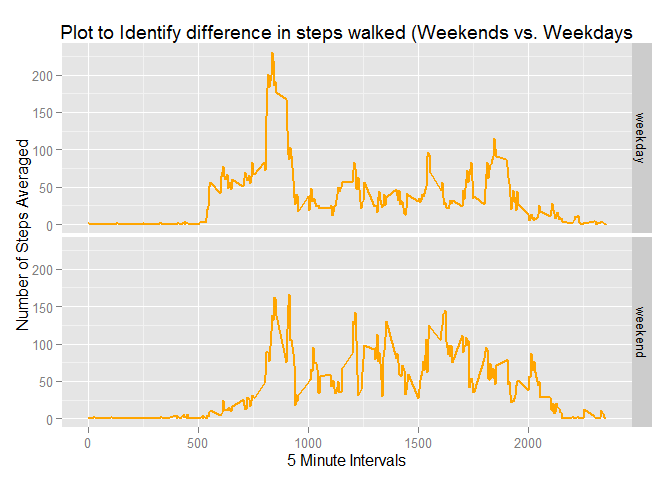

# Reproducible Research: Peer Assessment 1


## Loading and preprocessing the data

```r
library(ggplot2)
activity <- read.csv("activity/activity.csv",header = TRUE)
activity$date <- as.Date(activity$date, "%Y-%m-%d")
```

## What is mean total number of steps taken per day?

```r
sumsteps <- aggregate(activity$steps, by=list(activity$date), sum, na.rm=TRUE)

ggplot(data = sumsteps, aes(x = sumsteps$x))+ geom_histogram(binwidth = 2500, fill = 'green', col = 'black') + labs(x = 'Total steps', y = 'Frequency', title = 'Total Steps Per Day')
```

 


```r
meany <- mean(sumsteps$x)
mediany <- median(sumsteps$x)
```
The mean is 9354.2295082.  The Median is 10395.

## What is the average daily activity pattern?

```r
fiveminint <- aggregate(activity$steps, by=list(activity$interval), mean, na.rm=TRUE)
names(fiveminint) = c('interval', 'steps')
ggplot(data = fiveminint, aes(x = interval, y  = steps)) + geom_line(col = 'red', size = 1) + labs(x = 'Interval', y = 'Average Number of Steps', title ='Time Series Plot of Average Steps during 5 minute Intervals')
```

 

```r
question2 <- fiveminint[which.max(fiveminint$steps),]
```
The max number of steps is 206.1698113 at an interval of 835


## Imputing missing values

```r
counternas <- sum(is.na(activity$steps))
```
There are 2304 missing values in the dataset

My strategy for filling in all of the missing values in this dataset will be to use the Five Minute intervals


```r
activity2 <- activity 
for (i in 1:dim(activity)[1]) {
    if (is.na(activity2$steps[i])) {
        int <- activity2$interval[i]
        sub <- subset(fiveminint, interval == int)
        activity2$steps[i] <- sub$steps
    }
}
```
Here is the first few rows of the new dataset with missing NA values added in

```r
head(activity2)
```

```
##       steps       date interval
## 1 1.7169811 2012-10-01        0
## 2 0.3396226 2012-10-01        5
## 3 0.1320755 2012-10-01       10
## 4 0.1509434 2012-10-01       15
## 5 0.0754717 2012-10-01       20
## 6 2.0943396 2012-10-01       25
```
Here is a histogram of the total number of steps taken each day for the new Dataset.

```r
sumsteps2 <- aggregate(activity2$steps, by=list(activity2$date), sum)

ggplot(data = sumsteps2, aes(x = sumsteps2$x)) + geom_histogram(binwidth = 2500, fill = 'magenta', col = 'black') + labs(x = 'Total steps', y = 'Frequency', title = 'New Dataset - Total Number of Steps per day')
```

 


```r
meany2 <- mean(sumsteps2$x)
mediany2 <- median(sumsteps2$x)
```

The mean and median total steps per day of the new dataset are 1.0766189\times 10^{4} and 1.0766189\times 10^{4} respectively.

Comparing these to the original dataset, this new mean and median are fairly close to the original dataset.

## Are there differences in activity patterns between weekdays and weekends?

```r
activity2$date = as.Date(activity2$date)
activity2$day = factor(format(activity2$date, "%A"))
levels(activity2$day) = list(weekday = c("Monday", "Tuesday","Wednesday", "Thursday", "Friday"), weekend = c("Saturday", "Sunday"))
weekendy <- subset(activity2, activity2$day == 'weekend')
fiveminintweekend <- aggregate(weekendy$steps, by=list(weekendy$interval), mean)
fiveminintweekend$day <- 'weekend'

weekdayy <- subset(activity2, activity2$day == 'weekday')
fiveminintweekday <- aggregate(weekdayy$steps, by=list(weekdayy$interval), mean)
fiveminintweekday$day <- 'weekday'

fivemininty <- rbind(fiveminintweekend, fiveminintweekday)

names(fivemininty) = c('interval', 'steps', 'day')
ggplot(data = fivemininty, aes(x = interval, y  = steps)) + facet_grid(day~.) + geom_line(col = 'orange', size = 1) + labs(x = '5 Minute Intervals', y = 'Number of Steps Averaged', title ='Plot to Identify difference in steps walked (Weekends vs. Weekdays')
```

 
